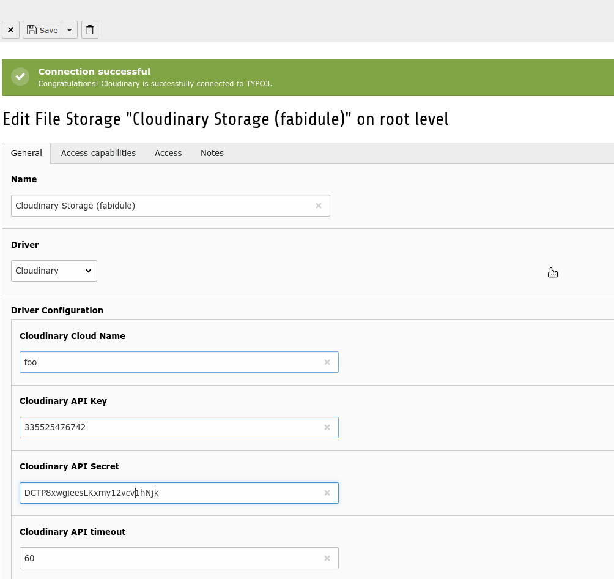

# Cloudinary Integration

A TYPO3 extension that connect TYPO3 with [Cloudinary](cloudinary.com) services
by the means of a **Cloudinary Driver for FAL**.
The extension also provides various View Helpers to render images on the Frontend.
Cloudinary is a service provider dealing with images and videos. 
It offers various services among other:

* CDN for fast images and videos delivering
* Manipulation of images and videos such as cropping, resizing and much more...
* DAM functionalities where images can be tagged and metadata edited

Installation
============

The extension should be done by Composer

```
composer require sinso/cloudinary
```

Note that the extension will require the library `cloudinary/cloudinary_php` and 
be automatically downloaded into `vendor`.


Configuration
=============

If it is not already the case, create an account on [Cloudinary](https://cloudinary.com/users/register/free) at first.
Once the extension is installed, we should create a [file storage](https://docs.typo3.org/m/typo3/reference-coreapi/master/en-us/ApiOverview/Fal/Administration/Storages.html). 

For a new "file storage" record, then:

* Pick the **Cloudinary** driver in the driver dropdown menu.
* Fill in the requested fields. Password and secrets can be found from the [Cloudinary Console](https://cloudinary.com/console).
* **Important!** Configure the "folder for manipulated and temporary images" on a local driver where we have a **writeable** processed folder.
  Example: `1:/_processed`


Once the record is saved, you should see a message telling the connection could be successfully established. 
You can now head to the File module list. 
Notice the first time you click on a folder in the File list module, 
it will take some time since the images must be fetched and downloaded for local processing.



Logging
-------

For the debug purposes Cloudinary API calls are logged to better track and understand how and when the API is called.
It might be useful to check the log file in case of a low response time in the BE.

```
tail -f public/typo3temp/var/logs/cloudinary.log
```

To decide: we now have log level INFO. We might consider "increasing" the level to "DEBUG".

Caveats and trouble shooting
----------------------------

* As said above, the first time a folder is clicked in the File list module, 
 images must be retrieved from Cloudinary to be locally processed and thumbnails generated.
 Be patient if you have many images to display.
* **Free** Cloudinary account allows 500 API request per day 
* This cloudinary FAL driver is currently **limited to images**.

ViewHelpers
-----------

The extension provides ViewHelpers that can be used like that:

1. Output an images and its source-set.

```
<html xmlns:c="http://typo3.org/ns/Sinso/Cloudinary/ViewHelpers">
    <c:cloudinaryImage image="{file}"/>
</html>
```

This will produces the following output:

```

```

2. Generate an array of variants that can be iterated.

```
<html xmlns:c="http://typo3.org/ns/Sinso/Cloudinary/ViewHelpers">
    <c:cloudinaryImageData image="{file}">
        <f:debug>{responsiveImageData}</f:debug>
    </c:cloudinaryImageData>
</html>
```

CLI Command
-----------

Move bunch of images from a local storage to a cloudinary storage.

**CAUTIOUS!**
1. Moving means: we are "manually" uploading a file
to the Cloudinary storage and "manually" deleting the one from the local storage.
Finally we are changing the `sys_file.storage value` to the cloudinary storage id.
Consequently, the file uid will be kept. File references are not touched.

2. The FE might break. Migrate your code that use VH `<f:image />` to `<c:cloudinaryImage />`
  

```shell script
./vendor/bin/typo3 cloudinary:move 1 2
# where 1 is the source storage (local)
# and 2 is the target storage (cloudinary)
```

The extension provides a tool to copy a bunch of files (restricted to images) from one storage to an another. 
This can be achieved with this command:

```shell script
./vendor/bin/typo3 cloudinary:copy 1 2         
# where 1 is the source storage (local)
# and 2 is the target storage (cloudinary)
 
# Ouptut:
Copying 64 files from storage "fileadmin/ (auto-created)" (1) to "Cloudinary Storage (fabidule)" (2)
Copying /introduction/images/typo3-book-backend-login.png
Copying /introduction/images/content/content-quote.png
...
Number of file copied: 64
``` 

Development tools
-----------------

Type command `make` at the source of the extension to display utility commands related to code formatting. 

```
Usage:
 make [target]

Available targets:
 help:            Help
 lint:           Display formatting issues in detail
 lint-summary:   Display a summary of formatting issues
 lint-fix:       Automatically fix code formatting issues
```

Web Hook
--------

Whenever uploading or editing a file through the Cloudinary Manager you can configure an URL
as a web hook to be called to invalidate the cache in TYPO3. 
This is highly recommended to keep the data consistent between Cloudinary and TYPO3. 

```shell script
https://domain.tld/?type=1573555440
```
**Beware**: do not rename, move or delete file in the Cloudinary Manager. TYPO3 will not know it as currently
implement. Uploading a new file will not be a problem though. 

Source of inspiration
---------------------

https://github.com/carlosocarvalho/flysystem-cloudinary/blob/master/src/CloudinaryAdapter.php

TODO
----

* Improve Web Hook when file get renamed / deleted / moved through the Cloudinary Manager.
